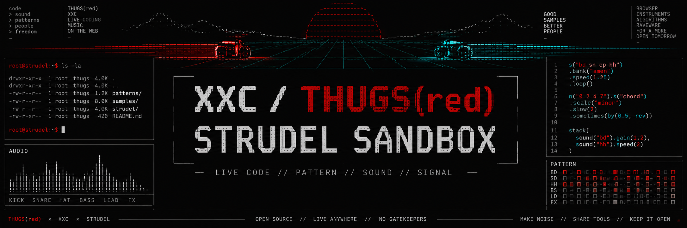
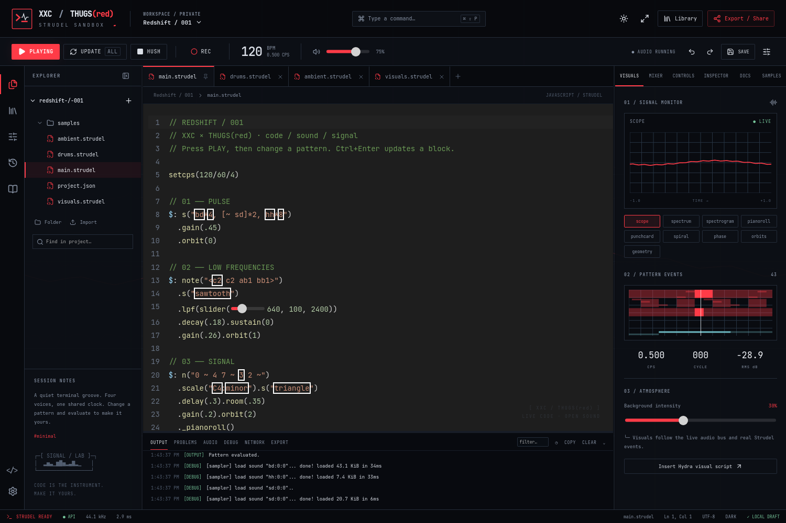
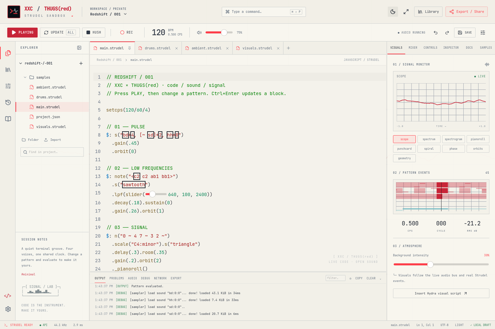
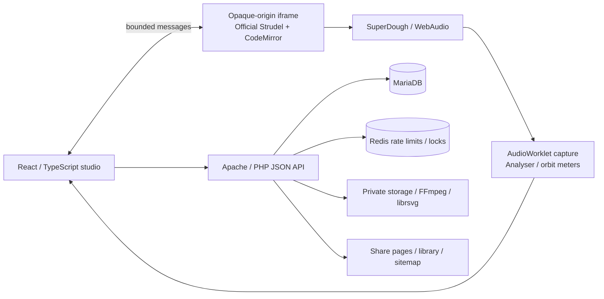

<div align="center">



**A live-coding workstation for code, sound, and signal.**

Write real Strudel. Perform a set. Shape a sample. Record the master output.
Publish a score, read someone else’s code, and make a remix.

[](https://strudel.xxc.dk)
[](https://strudel.cc)


[](LICENSE)

<samp>Apache + PHP in production · Node for builds · music happens in your browser</samp>

[**Open the studio**](https://strudel.xxc.dk) · [**Explore the library**](https://strudel.xxc.dk/library) · [**Read the wiki**](https://github.com/kawaiipantsu/strudel-xxc/wiki) · [**Join discussions**](https://github.com/kawaiipantsu/strudel-xxc/discussions)

</div>

## Contents

- [The workstation](#the-workstation)
- [Start making sound](#start-making-sound)
- [Architecture](#architecture)
- [Build and deploy](#build-and-deploy)
- [Security and ownership](#security-and-ownership)
- [Compatibility](#compatibility)
- [Documentation](#documentation)
- [Contribute](#contribute)
- [Licensing](#licensing)

## The workstation

| Area | What it does |
|---|---|
| **Editor** | Official Strudel CodeMirror integration: mini notation, event highlighting, sliders, inline visuals, completion, folding, search, multiple files and a command palette. |
| **Audio** | Official Strudel + SuperDough, independent orbits, master control, measured stereo/orbit levels and PCM recording through an AudioWorklet. |
| **Signal workbench** | Scope, FFT spectrum/spectrogram, stereo phase plot, pattern events, piano roll, spiral and geometry. Background animation follows actual audio and events. |
| **Sample Lab** | Microphone recording, upload, waveform selection, crop, cut, duplicate, reverse, fades, normalize, gain, looping, resampling and WAV export. |
| **Recording** | Uncompressed float PCM source; server exports WAV, 320 kbps MP3 and 256 kbps AAC/M4A with metadata and compatible PNG artwork. |
| **Projects** | Local crash recovery, server autosave, revision checkpoints, private/unlisted/public visibility, ZIP bundles and remix provenance. |
| **Library** | Search, tags, original examples, source inspection, audio previews, server-rendered share pages and a public sitemap. |
| **Admin** | Settings, themes, library moderation, metadata, media approval, sample packs, author overview, diagnostics and redacted activity logs. |

The visual language brings together [THUGS(red)](https://thugs.red), [XXC / WAF](https://waf.xxc.dk), and [ASCIITRON](https://asciitron.xxc.dk): JetBrains Mono, ASCII framing, bracketed status text, thin rules, and restrained red. Light mode uses warm engineering-paper surfaces. The README banner was supplied by the project owner.

## Inside the studio



<details>
<summary>Light / engineering paper theme</summary>



</details>

## Start making sound

1. Open [strudel.xxc.dk](https://strudel.xxc.dk). The editor is the homepage.
2. Press **Play**. Safari may ask for one more **Enable Audio** click inside the editor.
3. Change a pattern. **Ctrl/Cmd + Enter** evaluates the selected expression or logical block.
4. Use **Update** for the whole file and **Ctrl/Cmd + .** to hush.
5. **Ctrl/Cmd + S** saves. **Ctrl/Cmd + P** opens files; **Ctrl/Cmd + Shift + P** opens commands.
6. Record a take, make a code cover, and publish through **Export / Share**.

```javascript
setcps(120 / 60 / 4)

$: s("bd*4, [~ sd]*2, hh*8").gain(.4).orbit(0)

$: n("0 ~ 4 7 ~ 3 2 ~").scale("C4:minor")
  .s("triangle").room(.35).gain(.2).orbit(1)
  ._pianoroll()
```

The built-in `bd`, `sd`, `hh`, `oh`, `cp`, `rim`, `tone` and `xxc_wt` sounds are original procedural CC0 assets. External maps work through Strudel’s normal `samples()` and `tables()` APIs when their hosts permit browser access.

## Architecture



The frame is our custom editor/runtime; it does **not** embed the stock Strudel website. Evaluated code has no same-origin privilege and receives no session, CSRF, database, or administrator credentials. Public scores do not run when viewed or opened.

### Pinned engine versions

| Package | Version |
|---|---|
| `@strudel/core`, `mini`, `transpiler`, `draw`, `tonal`, `xen` | `1.2.6` |
| `@strudel/codemirror`, `webaudio`, `midi`, `soundfonts` | `1.3.0` |
| `superdough` | `1.3.0` |
| `@strudel/hydra`, `gamepad`, `serial` | `1.2.6` |
| `@strudel/osc` | `1.3.2` |
| `hydra-synth` | `1.4.0` |

All direct versions and the transitive dependency graph are locked. See [integration details](docs/STRUDEL_INTEGRATION.md) for the small WebKit output-channel and MIDI timer compatibility transforms.

## Build and deploy

This checkout is deployed on an existing Apache vhost whose document root is `html/`. The upstream proxy terminates TLS. The canonical public URL is always `https://strudel.xxc.dk`.

```bash
# Initial installation on the prepared XXC host (root required)
./scripts/setup.sh

# Future updates
npm ci --ignore-scripts
./scripts/migrate.sh
./scripts/build.sh
./scripts/package-source.sh
./scripts/healthcheck.sh

# Verification
./scripts/test.sh
```

The setup script calls `xxc-db-setup strudel` only when private configuration is missing. Never rerun database provisioning to rotate a password. Node serves no production requests. No application daemon is required.

| Location | Purpose |
|---|---|
| `html/` | Apache public files and PHP entry points |
| `frontend/`, `src/`, `public/` | Frontend source and original static assets |
| `backend/` | PHP API, storage, cover and media logic |
| `config/secrets.json` | Private database configuration and signing key; excluded from Git |
| `storage/` | Private uploaded/generated audio, artwork, sessions, temporary files and logs |
| `docs/ADMIN_CREDS.md` | One-time admin credential, mode `0600`; excluded from Git |
| `LICENSES/` | License texts and pinned dependency inventory |

## Security and ownership

- Administrator access: [**/admin/**](https://strudel.xxc.dk/admin/). Credentials are generated during installation and hashed with Argon2id.
- Anonymous project ownership uses a random, persistent HttpOnly browser cookie. Export a ZIP before clearing browser data or changing devices.
- Shared code executes only after an explicit Play/Evaluate action, inside a sandbox without `allow-same-origin`.
- Main/admin CSP excludes dynamic evaluation. The sandbox alone permits the module/evaluation formats required by upstream Strudel.
- Uploads are inspected by MIME and FFprobe, use generated internal names, and remain outside the web root. Controlled delivery supports byte ranges.
- Redis backs rate limits and conversion locks. Prepared statements, CSRF checks, optimistic save versions, bounded media jobs and strict session cookies protect the API.
- Sample/audio uploads have owner quotas and configured size/duration limits. A recording stops at the earlier duration or PCM byte limit.

Read [SECURITY.md](docs/SECURITY.md) before changing the iframe, proxy, media routes or session configuration.

## Compatibility

Core playback, PCM recording, sample editing, persistence and responsive UI are exercised in Chromium and Playwright WebKit. Real MIDI hardware, microphones, serial devices and audio output hardware still need verification on the user’s machine. WebKit testing on Linux does not cover every Safari/iOS hardware configuration.

Hydra needs WebGL. MIDI needs browser support and an explicit connection in Controls. OSC needs an external bridge; no Node/OSC production service is installed. WebSerial is detected but isolated runtime permissions may prevent native access. External soundfonts and sample maps retain their own licenses and CORS requirements. This is an online-first studio with a best-effort offline shell, not a guarantee that uncached external samples will work offline.

## Verification

**14 browser tests · 52 backend checks · 4 audio utility tests passed.** The suite exercises actual signal output, captured PCM, codecs, permissions and sharing on the deployed HTTPS origin. See the [verification report](docs/VERIFICATION.md) for scope and hardware boundaries.

## Documentation

| Guide | Contents |
|---|---|
| [Installation](docs/INSTALL.md) | Exact server setup and prerequisites |
| [Architecture](docs/ARCHITECTURE.md) | Runtime, trust boundaries, persistence and rendering |
| [Operations](docs/OPERATIONS.md) | Deployment, backup, cleanup, log rotation and recovery |
| [Administrator guide](docs/ADMIN.md) | Moderation, settings and credential rotation |
| [API](docs/API.md) | Routes, authorization, errors and limits |
| [Security](docs/SECURITY.md) | Execution isolation and storage policy |
| [Strudel integration](docs/STRUDEL_INTEGRATION.md) | Packages, upstream APIs and compatibility |
| [Audio engine](docs/AUDIO_ENGINE.md) | Routing, PCM, meters and encoding |
| [Storage](docs/STORAGE.md) | Ownership, sample URLs, bundles and retention |
| [Third-party licenses](docs/THIRD_PARTY_LICENSES.md) | Complete pinned inventory and notices |
| [Troubleshooting](docs/TROUBLESHOOTING.md) | Playback, Safari, permissions and recovery |

## Contribute

Use [Discussions](https://github.com/kawaiipantsu/strudel-xxc/discussions) for scores, sample-making techniques, wishes, and questions. Report reproducible defects through [Issues](https://github.com/kawaiipantsu/strudel-xxc/issues). Include browser/OS, the smallest useful score, and the relevant Output/Problems messages. Do not include credentials or private sample links.

See [CONTRIBUTING.md](CONTRIBUTING.md). Changes to the audio runtime need browser playback tests; changes to access control need negative authorization tests.

## Licensing

The application is **AGPL-3.0-or-later**, consistent with the [official Strudel integration guidance](https://strudel.cc/technical-manual/project-start/). Network users can access the complete application source here and through the studio’s source link. License notices, build scripts and the dependency lock are included. Operators of modified deployments must provide their corresponding source as required by the license.

Original bundled sample waveforms and example scores are **CC0-1.0**. Third-party packages, fonts and icons keep their respective notices. User compositions and uploaded media remain subject to their owners’ chosen rights; publishing does not silently assign a new license to them.

---

<div align="center"><samp>XXC / THUGS(red) · MAKE NOISE · SHARE TOOLS · KEEP IT OPEN</samp></div>
